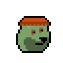
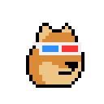
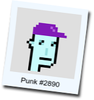
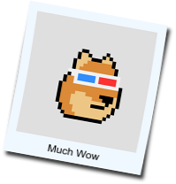
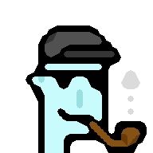
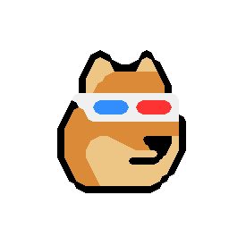

#  DIY (Do-It-Yourself) - Yes, You Can! Design Your Own Punks Using the Punk (Building) Blocks

Use the [free ImageMagick tools](https://imagemagick.org)
to make your own punks.


### Alien with Cap Forward, Small Shades & Pipe

Let's make punk #7804 - a super rare alien

with a capforward
,
smallshades

and a pipe

from scratch:

```
$ magick convert alien-male.png \
                 capforward.png \
                 smallshades.png \
                 pipe.png \
         -background none -flatten punk7804.png
```

<!--
$ magick convert alien-male.png capforward.png smallshades.png pipe.png -background none -flatten punk7804.png
-->

Now open up the new `punk7804.png`. Enjoy your million-dollar punk look-a-alike. Yes, it's
a 100% true authentic pixel ~~copy~~ original.


Zooming In - 2x, 4x


Scale up the image by doubling the pixels (that is, use the `-filter point` option).
Let's try 2x (that is, 200%):

```
$ magick convert punk7804.png \
         -filter point -resize 200% punk7804@2x.png
```

<!--
$ magick convert punk7804.png -filter point -resize 200% punk7804x2.png
 -->


And 4x (that is, 400%):

```
$ magick convert punk7804.png \
         -filter point -resize 400% punk7804@4x.png
```


<!--
$ magick convert punk7804.png -filter point -resize 400% punk7804x4.png
 -->


Why stop? Let's add a smile !

```
$ magick convert punk7804.png \
                 smile-alien.png \
         -background none -flatten punk7804_smile.png
```

<!--
$ magick convert punk7804.png smile-alien.png  -background none -flatten punk7804_smile.png
-->

   2x, 4x:


Try the natural version :

   2x, 4x:


#### Alien Invasion

Let's try the green (120°) variant.
Let's make - a super rare alien

with a capforward
,
smallshades

and a pipe

from scratch:

```
$ magick convert alien-male_120.png \
                 capforward.png \
                 smallshades.png \
                 pipe.png \
         -background none -flatten punk7804_120.png
```

<!--
$ magick convert alien-male_120.png capforward.png smallshades.png pipe.png -background none -flatten punk7804_120.png

$ magick convert punk7804_120.png -filter point -resize 200% punk7804_120x2.png

$ magick convert punk7804_120.png -filter point -resize 400% punk7804_120x4.png
-->

   2x, 4x:


Or try the 90°  variant - `alien-male_90.png`:

   2x, 4x:


Or 150°  - `alien-male_150.png`:

   2x, 4x:


### Alien with Cap

Let's make punk #2890 - another super rare alien

with a cap

from scratch:

```
$ magick convert alien-male.png \
                 cap.png \
         -background none -flatten punk2890.png
```

<!--
$ magick convert alien-male.png cap.png -background none -flatten punk2890.png
-->


   2x, 4x:


Try the natural version :

   2x, 4x:


#### All Caps

Let's try the red (0°) variant.
Let's make - a super rare alien

with a cap

from scratch:

```
$ magick convert alien-male.png \
                 cap_0.png \
         -background none -flatten punk2890_0.png
```

<!--
$ magick convert alien-male.png cap_0.png -background none -flatten punk2890_0.png

$ magick convert punk2890_0.png -filter point -resize 200% punk2890_0x2.png

$ magick convert punk2890_0.png -filter point -resize 400% punk2890_0x4.png
-->

   2x, 4x:


Or try the blue (240°)  variant - `cap_240.png`:

   2x, 4x:


### Humans with Cap

Or let's make a (light skintone) human punk

with a red (0°) cap

and a smile

from scratch:


```
$ magick convert human-male_light.png \
                 cap_0.png \
                 smile.png \
         -background none -flatten human_light.png
```

<!--
$ magick convert human-male_light.png cap_0.png smile.png -background none -flatten human_light.png

$ magick convert human_light.png -filter point -resize 200% human_lightx2.png
-->

   2x, 4x:


Or try the dark skintone  variant - `human-male_dark.png` -
with a green (120°) cap   - `cap_120.png`:


<!--
$ magick convert human-male_dark.png cap_120.png smile.png -background none -flatten human_dark.png
-->


   2x, 4x:


### Doge Shiba Inu - Much Wow

Let's make a doge punk  - a super rare alien

with a headband

from scratch:

```
$ magick convert alien.png \
                 headband.png \
         -background none -flatten doge3100.png
```

<!--
 $ magick convert alien.png headband.png -background none -flatten doge3100.png

 $ magick convert doge3100.png -filter point -resize 200% doge3100x2.png
  -->

 2x, 4x:


Or let's make a zombie

with a knitted cap

from scratch:


```
$ magick convert zombie_notop.png \
                 knittedcap.png \
         -background none -flatten doge2066.png
```

<!--
 $ magick convert zombie_notop.png knittedcap.png -background none -flatten doge2066.png

 $ magick convert doge2066.png -filter point -resize 200% doge2066x2.png
  -->

 2x, 4x:




Or let's make a classic

with a 3d glasses

from scratch:


```
$ magick convert classic.png \
                 3dglasses.png \
         -background none -flatten doge_3dglasses.png
```

<!--
 $ magick convert classic.png 3dglasses.png -background none -flatten doge_3dglasses.png

 $ magick convert doge_3dglasses.png -filter point -resize 200% doge_3dglassesx2.png
  -->


 2x, 4x:




And so on. Yes, you can.


## Bonus - ImageMagick Special Effects

Use the [free ImageMagick tools](https://imagemagick.org)
to script special effects (on the command line).


### Polaroid-Like Photos

Let's start with a "plain vanilla" punk, that is, #2890  and
let's use the 4x (96×96) version
and turn it into a captioned polaroid-like photo:

```
$ magick convert punk2890x4.png \
          -gravity center -set caption "Punk #2890" \
          -caption '%c' \
          -border 5x5 \
          -bordercolor AliceBlue -background black  +polaroid \
          polaroid2890.png
```




And let's try some more:





### Magnify 2x, 3x 4x with (Smooth) Pixel Art Scaling Algorithm

Let's start with a "plain vanilla" punk, that is, #2890  and
let's use 2x magnified (48×48) version
using a (smooth) [pixel art scaling algorithm¹](https://en.wikipedia.org/wiki/Pixel-art_scaling_algorithms)):

Note¹: ImageMagic uses the [scale2x](http://www.scale2x.it/algorithm) algorithm

<!--
  more on github @ https://github.com/amadvance/scale2x/
  -->


```
$ magick convert punk2890.png \
          -magnify \
          punk2890@magnify2x.png
```


And doubling again (4x):

```
$ magick convert punk2890.png \
          -magnify -magnify \
          punk2890@magnify4x.png
```


And doubling again (8x):

```
$ magick convert punk2890.png \
          -magnify -magnify -magnify \
          punk2890@magnify8x.png
```


And let's try some more:








Power Tip - Let's retry with the [high quality scale (hqx)
pixel art scaling algorithm family](https://en.wikipedia.org/wiki/Hqx) in the 2x, 3x and 4x variants.

Note:  A free ImageMagick tools installation gets you
a copy of ffmpeg. Let's try:

```
$ ffmpeg -i punk2890.png \
          -filter_complex hqx=2 \
          punk2890@hq2x.png
```


And 3x:

```
$ ffmpeg -i punk2890.png \
          -filter_complex hqx=3 \
          punk2890@hq3x.png
```


And 4x:

```
$ ffmpeg -i punk2890.png \
          -filter_complex hqx=4 \
          punk2890@hq4x.png
```


And let's try some more:


And so on. Yes, you can.


## Questions? Comments?

Post them over at the [Help & Support](https://github.com/geraldb/help) page. Thanks.


